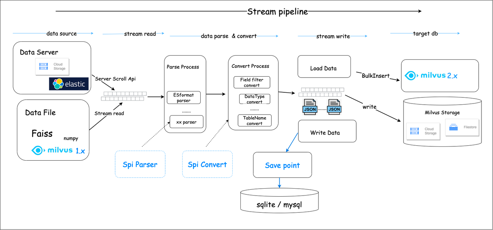

# Milvus Migration: migrate data to Milvus 2.x

## Overview

[milvus-migration](https://github.com/zilliztech/milvus-migration) is a data migration tool
for [Milvus](https://milvus.io/) that supports importing **Milvus 0.9.x ~ 1.x** / **faiss** / **elasticsearch7.x+**
datas to milvus 2.x.

## Architecture



## Getting started

### Prerequisites

- Operating System Requirements

| Operating System | Supported Versions |
|:-----------------|:-------------------|
| CentOS           | 7.5 or later       |
| Ubuntu LTS       | 18.04 or later     |

- Software Requirements

| Software                                 | Version           |
|:-----------------------------------------|:------------------|
| [Milvus](https://milvus.io/)             | 0.9.x, 1.x or 2.x |
| [Elasticsearch](https://www.elastic.co/) | 7.x or  8.x       |
| go                                       | 1.20.2 or later   |

- Data Format Support

| Source Data Type         | Target Data Type |
|:-------------------------|:-----------------|
| Milvus 0.9.x - 1.x       | Milvus 2.x       |
| Elasticsearch 7.x-8.x    | Milvus 2.x       |
| Faiss (Beta)             | Milvus 2.x       |
| Milvus 2.x (in progress) | Milvus 2.x       |

### How to use this tool?

1. Download the source code and build it:

```shell
git clone git@github.com:zilliztech/milvus-migration.git
go build
```

2. After building, you will obtain the `milvus-migration` binary file. Place this file and the `migration.yaml` file in
   the directory structure like below:

```text
directory
---- milvus-migration
---- configs/migration.yaml
```

3. Milvus1.x or Faiss to Milvus2.x migration

Run the command `dump` to dump the source data to numpy:

```shell
./milvus-migration dump
```

Finally, load the numpy files to Milvus 2.x successfully by using the `load` command:

```shell
./milvus-migration load
```

4. Elasticsearch to Milvus2.x migration:

Run the command `start` to migration es->2.x. here `start` == `dump && load` cmd

```shell
./milvus-migration start
```

## Migration Examples (migration.yaml details)

how to learn more about using migration tool, see examples doc below:

1. es ->
   milvux2.x : [migrate_es_doc](README_ES.md).
2. milvus1.x ->
   milvux2.x : [migrate_1.x_doc](README_1X.md).
3. faiss -> milvux2.x (
   Beta) : [migrate_faiss_doc](README_FAISS.md).

## How to verify migration result
When migration finished, you can use visual tool `Attu` or use Milvus SDK verify your new collection data rows.

- [Attu](https://github.com/zilliztech/attu)
- [Milvus SDK - Get Rows](https://milvus.io/api-reference/java/v2.2.x/Collection/getCollectionStatistics().md)

## Build Index and search
After the Milvus collection Data migration is completed, we can use SDK or `Attu` to create index and load collection for the next search operation.
- [SDK - build index](https://milvus.io/docs/build_index.md)
- [SDK - load collection](https://milvus.io/docs/load_collection.md)
- [SDK - vector search](https://milvus.io/api-reference/java/v2.2.x/Query%20and%20Search/search().md)
   
## Future work

- [ ] Milvus 2.x to Milvus 2.x
- [ ] Support others datasource to Milvus 2.x
- [ ] Supports binary vectors

## Contributing
Contributions to milvus-migration are welcome from everyone. See [Contributing](Contributing.md) for details of the contribution workflow.  